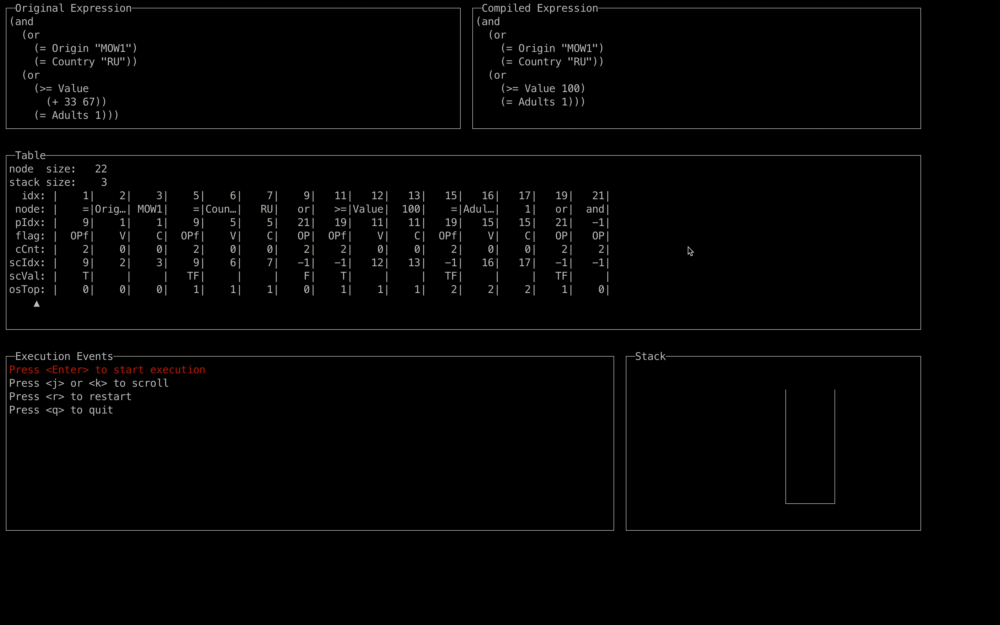

# Eval

**Eval** is an expression evaluation engine purely written in golang with only go stand libraries.
It takes a string expression, compiles the expression into a highly optimized structure, then efficiently evaluates the
result of the expression.

## Highlights

* Fast, probably **the fastest** expression evaluation engine in the go world ([benchmark](#benchmark)).
* Easy to use, support for registering custom operators, variables, constants and writing comments in expressions.
* Useful tools:
    * [Debug Panel](#debug-panel): a Terminal UI to help you understand how your expressions are executed.
    * [Expression Cost Optimizer](#expression-cost-optimizer): it uses Machine Learning algorithms to optimize your expressions and make them even faster.

## Basic Usage

### Install

```bash
go get github.com/onheap/eval
```

### Example

[Play Online](https://go.dev/play/p/DLp87Sqe8gF)

```go
package main

import (
    "fmt"
    "github.com/onheap/eval"
)

func main() {
    expr := `(and (>= age 30) (= gender "Male"))`

    vars := map[string]interface{}{
        "age":    30,
        "gender": "Male",
    }

    // new config and register variables
    config := eval.NewConfig(eval.RegVarAndOp(vars))

    // compile string expression to program
    program, err := eval.Compile(config, expr)
    
    // evaluation expression with the variables
    res, err := program.Eval(eval.NewCtxFromVars(config, vars))

    if err != nil {
        panic(err)
    }

    fmt.Printf("%v", res)
}
```

### Key Concepts
#### Expressions

Currently, the evaluation expressions should be written in [S-Expression](https://en.wikipedia.org/wiki/S-expression) syntax, A.K.A. Lisp-like syntax. And the Infix Notation is working in progress (Please let me know if you want this feature urgent).

Please see examples below:

One line string expression:
```lisp
(and (>= age 30) (= gender "Male"))
```

Multi-line string expression (two semicolons `;;` starts a comments):
```lisp
(and
  (>= age 18) ;; Adult
  (= locale "en-US"))
```

Example of creating a list with parentheses:
```lisp
(in locale 
  ("en-US" "en-CA")) ;; List of North America locales
```

Example of if-else statement:
```lisp
(if is_student
  (> balance 100) ;; Students only require a $100 balance
  (> balance 3000))
```

Example of using Constant and Operator. The `IOS` is a customized constant which can be predefined in [ConstantMap](compiler.go#L137). The sub-expression `(to_version "2.3.4")` calls the `to_version` operator to parse the string literal `2.3.4` to specific number for outer comparison expression. 
```lisp
(and           
  (= platform IOS) ;; IOS is a constant  
  (>= app_version 
    (to_version "2.3.4")))
```

### Variables
In the above expression examples you have already seen the variables. For example, in expression: `(and (>= age 30) (= gender "Male"))`, `age` and `gender` are variables. The variable associated values are retrieved through the [VariableFetcher](variable.go#L38) during the expression evaluation.

```go
type VariableFetcher interface {
    Get(varKey VariableKey, strKey string) (Value, error)
}
```
Please note that there are two types of keys in method parameters. The `varKey` is of type _[VariableKey](engine.go#L9)_, the `strKey` is of type _string_.

The `VariableKey` typed keys are required to be [registered](variable.go#L47) or pre-defined into the [VariableKeyMap](compiler.go#L139) explicitly, to build the connections between `varKey` and variable string literal in expressions. String typed keys can be used directly without the registration step. the value of a `strKey` the string literal in expressions.

The `varKey` offers better performance, the `strKey` offers more flexibility. You can use any of them (or hybrid), as they both are passed in during the expression evaluation. But we recommend using the `varKey` to get better performance.

### Operators
Operators are functions in the expression. Below is a list of the built-in operators. Customized operators can be [registered](operator.go#L11) or pre-defined into the [OperatorMap](compiler.go#L138)  

| Operator | Alias                   | Example                                                                                       | Description                                                                                                                |
|----------|-------------------------|-----------------------------------------------------------------------------------------------|----------------------------------------------------------------------------------------------------------------------------|
| add      | +                       | `(+ 1 1)`                                                                                     | Addition operation for two or more numbers.                                                                                |
| sub      | -                       | `(- 3 2)`                                                                                     | Subtraction operation for two or more numbers.                                                                             |
| mul      | *                       | `(* 1 2 3)`                                                                                   | Multiplication operation for two or more numbers.                                                                          |
| div      | /                       | `(/ 6 3)`                                                                                     | Division operation for two or more numbers.                                                                                |
| mod      | %                       | `(% 3 7)`                                                                                     | Modulus operation for two or more numbers.                                                                                 |
| and      | &, &&                   | `(and (>= age 30) (= gender "Male"))`                                                         | Logical AND operation for two or more booleans.                                                                            |
| or       | \|,   \|\|              | `(or (< age 18) (> age 80))`                                                                  | Logical OR operation for two or more booleans.                                                                             |
| not      | !                       | `(not is_student))`                                                                           | Logical NOT operation for a boolean value.                                                                                 |
| xor      | N/A                     | `(xor true false)`                                                                            | Logical OR operation for two or more booleans.                                                                             |
| eq       | =, ==                   | `(= gender "Female")`                                                                         | Two values are equal.                                                                                                      |
| ne       | !=                      | `(!= gender "Female")`                                                                        | Two values are not equal.                                                                                                  |
| gt       | >                       | `(> 2 1)`                                                                                     | Greater than.                                                                                                              |
| ge       | >=                      | `(>= age 18)`                                                                                 | Greater than or equal to.                                                                                                  |
| lt       | <                       | `(< 3 5)`                                                                                     | Less than.                                                                                                                 |
| le       | <=                      | `(<= score 80)`                                                                               | Less than or equal to.                                                                                                     |
| between  | N/A                     | `(between age 18 80)`                                                                         | Checking if the value is between the range. The between operator is inclusive: begin and end values are included.          |
| in       | N/A                     | `(in locale ("en-US" "en-CA"))`                                                               | Checking if the value is in the list.                                                                                      |
| overlap  | N/A                     | `(overlap languages ("en" "zh"))`                                                             | Checking if the two lists are overlapped.                                                                                  |
| date     | t_date, to_date         | `(date "2021-01-01")`<br/>  `(date "2021-01-01" "2006-01-02")`                                | Parse a string literal into date. The second parameter represents for layout and is optional.                              |
| datetime | t_datetime, to_datetime | `(datetime "2021-01-01 11:58:56")`<br/>  `(date "2021-01-01 11:58:56" "2006-01-02 15:04:05")` | Parse a string literal into datetime. The second parameter represents for layout and is optional.                          |
| version  | t_version, to_version   | `(to_version "2.3.4")` <br/> `(to_version "2.3" 2)`                                           | Parse a string literal into a version. The second parameter represents the count of valid version numbers and is optional. | 

### Useful Features
* **TryEval** tries to execute the expression when only partial variables are fetched. It skips sub-expressions where no variables were fetched, tries to find at least one sub-branch that can be fully executed with the currently fetched variables, and returns the final result.
  > It is typically used for the scenarios that fetching variables is expansive and the root operator is bool operators.

  
* **ReportEvent** is a configuration option. If it is enabled, the evaluation engine will send events to the EventChannel for each execution step. We can use this feature to observe the internal execution of the engine and to collect statistics on the execution of expressions. [Debug Panel](#debug-panel) and [Expression Cost Optimizer](#expression-cost-optimizer) are two example usages of this feature.  


* **Dump / DumpTable / IndentByParentheses**
  * [Dump](util.go#L400) decompiles the compiled expressions into the corresponding string expressions.
  * [DumpTable](util.go#L524) dumps the compiled expressions into an easy-to-understand format.
  * [IndentByParentheses](util.go#L290) formats string expressions.


### Compile Options
* **ConstantFolding** evaluates constant subexpressions at compile time to reduce the complicity of the expression.
  <details>
  <summary>
  Examples
  </summary>
    <table>
    <tr>
      <th style="text-align:center;width:400px">Original Expression</th>
      <th style="text-align:center;width:400px">Decompiled Expression</th>
    </tr>
    <tr>
      <td>
  
  ```lisp
  (<
    (- (now) registered_time)
    (* 7 24 3600) ;; one week seconds
  )
  ```
    </td>
    <td>
  
  ```lisp
  (<
    (-
      (now) registered_time) 604800)
  ```
  
    </td>
    </tr>
    <tr>
    <td>
  
  ```lisp  
  (<
    (+ v1
      (- 2 3)
      (/ 6 3) 4)
    (* 5 6 7))
  ```
    </td>
    <td>
  
  ```lisp   
  (< (+ v1 -1 2 4) 210)
  ```
    </td>
    </tr>
    </table>
  </details>


* **ReduceNesting** flattens `and` and `or` operators to reduce the nesting level of the expression. Makes short circuits more efficient.
  <details>
  <summary>
  Examples
  </summary>
    <table>
    <tr>
      <th style="text-align:center;width:400px">Original Expression</th>
      <th style="text-align:center;width:400px">Decompiled Expression</th>
    </tr>
    <tr>
      <td>

  ```lisp
  (and
    ;; US adult users
    (and            
      (> age 18)                           
      (= address.country "US"))
    ;; With good credit and enough balance
    (and            
      (>= credit Good)                     
      (>= balance 4000)))                  
  ```
    </td>
    <td>

  ```lisp
  (and                      
    (> age 18)              
    (= address.country "US")
    (>= credit Good)        
    (>= balance 4000))       
  ```

    </td>
    </tr>
    <tr>
    <td>

  ```lisp  
  (or                 
    (and              
      (and a b)       
      (and c d))      
    (or               
      (or e f)        
      (or h           
        (or j k l)))) 
  ```
    </td>
    <td>

  ```lisp   
  (or                   
    (and a b c d)       
    (or e f h j k l))   
  ```
    </td>
    </tr>
    </table>
  </details>


* **FastEvaluation** optimizes hot path subexpressions to reduce the number of loops and stack operations in the evaluation engine.
  <details>
  <summary>
  Examples
  </summary>
  
  The idea behind the FastEvaluation is similar to the [inlining optimisation](https://en.wikipedia.org/wiki/Inline_expansion). When the FastEvaluation enabled, the optimise-able subexpression be compiled in prefix notation instead of the postfix notation like the original [Reverse Polish notation](https://en.wikipedia.org/wiki/Reverse_Polish_notation), so that the operators can directly get the parameters from the following nodes.
    
  <table>
  <tr>
  <td colspan="2"> Expression:
  
  ```lisp
  (> age 18)
  ```
  </td>
  </tr>
    <tr>
      <td style="width: 5px"> <strong>Without</strong> <br> FastEvaluation</td>
  <td>

  ```
   node  size:    3          
   stack size:    2          
     idx: |    0|    1|    2|
    node: |  age|   18|    >|
    pIdx: |    2|    2|   -1|
    flag: |    V|    C|   OP|
    cCnt: |    0|    0|    2|
   scIdx: |    0|    1|   -1|
   scVal: |     |     |     |
   osTop: |    0|    1|    0|      
  ```

    </td>
    </tr>
    <tr>
    <td style="width: 5px"> <strong>With</strong> <br> FastEvaluation</td>
    <td>

  ```
   node  size:    3          
   stack size:    1          
     idx: |    0|    1|    2|
    node: |    >|  age|   18|
    pIdx: |   -1|    0|    0|
    flag: |  OPf|    V|    C|
    cCnt: |    2|    0|    0|
   scIdx: |    0|    1|   -1|
   scVal: |     |     |     |
   osTop: |    0|    0|    0|  
  ```

    </td>
    </tr>
    </table>
  
  When the FastEvaluation disabled, the execution sequence of the expression will be `age`, `18`, `>`.
    1. push `age` to stack. 
    2. push `18` to stack.
    3. execute the `>` operator with the parameters (`age`, `18`) that popped from stack

  When the FastEvaluation enabled, the execution sequence of the expression will be `>`, `age`, `18`.
  1. execute the `>` operator with the parameters (`age`, `18`) that directly **inlined** from the expression

  <table>
  <tr>
  <td colspan="2"> <strong>Expression</strong>:

  ```lisp
  (and                      
    (> age 18)              
    (= address.country "US")
    (>= credit Good)        
    (>= balance 4000)) 
  ```
  </td>
  </tr>
    <tr>
      <td style="width: 5px"> <strong>Without</strong> <br> FastEvaluation</td>
  <td>
  
  ```
   node  size:   13                                                                       
   stack size:    5                                                                       
     idx: |    0|    1|    2|    3|    4|    5|    6|    7|    8|    9|   10|   11|   12|
    node: |  age|   18|    >|addr…|   US|    =|bala…| 4000|   >=|cred…| Good|   >=|  and|
    pIdx: |    2|    2|   12|    5|    5|   12|    8|    8|   12|   11|   11|   12|   -1|
    flag: |    V|    C|   OP|    V|    C|   OP|    V|    C|   OP|    V|    V|   OP|   OP|
    cCnt: |    0|    0|    2|    0|    0|    2|    0|    0|    2|    0|    0|    2|    4|
   scIdx: |    0|    1|   -1|    3|    4|   -1|    6|    7|   -1|    9|   10|   -1|   -1|
   scVal: |     |     |    F|     |     |    F|     |     |    F|     |     |   TF|     |
   osTop: |    0|    1|    0|    1|    2|    1|    2|    3|    2|    3|    4|    3|    0|      
  ```

    </td>
    </tr>
    <tr>
    <td style="width: 5px"> <strong>With</strong> <br> FastEvaluation</td>
    <td>

  ```
   node  size:   13                                                                      
   stack size:    4                                                                      
     idx: |    0|    1|    2|    3|    4|    5|    6|    7|    8|    9|   10|   11|   12|
    node: |    >|  age|   18|    =|addr…|   US|   >=|bala…| 4000|   >=|cred…| Good|  and|
    pIdx: |   12|    0|    0|   12|    3|    3|   12|    6|    6|   12|    9|    9|   -1|
    flag: |  OPf|    V|    C|  OPf|    V|    C|  OPf|    V|    C|  OPf|    V|    V|   OP|
    cCnt: |    2|    0|    0|    2|    0|    0|    2|    0|    0|    2|    0|    0|    4|
   scIdx: |   -1|    1|    2|   -1|    4|    5|   -1|    7|    8|   -1|   10|   11|   -1|
   scVal: |    F|     |     |    F|     |     |    F|     |     |   TF|     |     |     |
   osTop: |    0|    0|    0|    1|    1|    1|    2|    2|    2|    3|    3|    3|    0|  
  ```
  
    </td>
    </tr>
    </table>
  </details>    


* **Reordering** reorders subexpressions based on the execution cost. Priory to execute subexpression with less cost, trigger short circuit earlier.
  <details>
  <summary>
  Examples
  </summary>
    <table>
    <tr>
      <th style="text-align:center;width:400px">Original Expression</th>
      <th style="text-align:center;width:400px">Decompiled Expression</th>
    </tr>
    <tr>
      <td>

  ```lisp
  (and                      
    (> age 18)          ;; costs 20 
    (= country "US")    ;; costs 40 
    (>= credit Good)    ;; costs 30       
    (>= balance 4000))  ;; costs 10                  
  ```
    </td>
    <td>

  ```lisp
  ;; reordered based on subexpression costs
  (and               
    (>= balance 4000)   ;; costs 10 
    (> age 18)          ;; costs 20 
    (= country "US")    ;; costs 30 
    (>= credit Good))   ;; costs 40 
  ```

    </td>
    </tr>
    <tr>
    <td>
  
  Fetching value of variable `credit` costs 100, others cost 7.
  
  ```lisp   
  (and                                    
    (or                                   
      (>= credit Good) ;; costs 100        
      (overlap                            
        ("top" "high_value") user_tags))  
    (not                                  
      (in "F" user_tags)))                 
  ```
    </td>
    <td>

  The `or` subexpression is moved to a later position because the cost of fetching `credit` is higher than the other subexpressions.

  ```lisp   
  (and                                         
    (not                                       
      (in "F" user_tags))                      
    (or                                        
      (overlap ("top" "high_value") user_tags) 
      (>= credit Good)))                       
                                                
  ```
    </td>
    </tr>
    </table>
  </details>  

## Tools
#### Debug Panel



A Terminal UI that shows compiled expression structural and step-by-step execution progress. Helps you understand how your expression is executed.

[Learn more →](https://github.com/onheap/eval_lab/tree/main/tui).

#### Expression Cost Optimizer

It uses [Genetic Algorithms](https://en.wikipedia.org/wiki/Genetic_algorithm) (others are optional) to optimize the over all expressions execution time, generates the best scores for the `CostsMap`. 

As shown in the figure below, the total number of executing all rules over all users decreases from 600398 to 558686, reduced by ~7% after ten generations.

```go
initial execution count: 600398
Best fitness at generation 0: 587977.000000
Best fitness at generation 1: 585488.000000
Best fitness at generation 2: 583040.000000
Best fitness at generation 3: 560880.000000
Best fitness at generation 4: 560880.000000
Best fitness at generation 5: 560880.000000
Best fitness at generation 6: 560880.000000
Best fitness at generation 7: 559697.000000
Best fitness at generation 8: 557820.000000
Best fitness at generation 9: 556075.000000
Best fitness at generation 10: 556075.000000
```
[Learn more →](https://github.com/onheap/eval_lab/tree/main/optimizer).

<details>
<summary>
Generated <code>CostsMap</code> scores
</summary>

```go
{
        `address`: 257.5637323444525,
        `address.city`: -29.732067230828733,
        `address.country`: -4.445875953501092,
        `address.state`: -2.733315237719508,
        `age`: 13.534118456114095,
        `app_version`: 81.96361572619793,
        `balance`: 6.5089373401145805,
        `birth_date`: 29.504377681831215,
        `created_at`: 1.8939662469501435,
        `credit`: -14.994423737587496,
        `credit_limit`: -20.952782417744316,
        `discount`: 1.516122498612845,
        `distance`: -2.461526385425413,
        `gender`: -20.00951321901351,
        `interests`: -1.9843024344711226,
        `is_birthday`: 2.0701165078726405,
        `is_student`: -6.213750700033799,
        `is_vip`: 222.7708005914785,
        `language`: -60.04923908428884,
        `now`: 85.7151642404042,
        `os_version`: -0.0051749009548118785,
        `platform`: -8.66752799417992,
        `updated_at`: 36.56643865523681,
        `user_id`: 20.934025789111697,
        `user_tags`: -6.7672454401690025,
}
```
</details>

## Benchmark

Benchmark between different Go Expression Evaluation projects. 
```bash
❯ go test -bench=. -run=none -benchtime=3s -benchmem
goos: darwin
goarch: amd64
pkg: github.com/onheap/eval_lab/benchmark/projects
cpu: Intel(R) Core(TM) i9-9980HK CPU @ 2.40GHz
 Benchmark_bexpr-16              1748103          2033 ns/op           888 B/op          45 allocs/op
 Benchmark_celgo-16             26671797           134.9 ns/op          16 B/op           1 allocs/op
┌────────────────────────────────────────────────────────────────────────────────────────────────────┐
│Benchmark_eval-16              53657851            63.31 ns/op         32 B/op           1 allocs/op│
└────────────────────────────────────────────────────────────────────────────────────────────────────┘
 Benchmark_tryEval-16           27411960           126.4 ns/op          32 B/op           1 allocs/op
 Benchmark_evalfilter-16         2012268          1796 ns/op           848 B/op          24 allocs/op
 Benchmark_expr-16              27877728           122.5 ns/op          32 B/op           1 allocs/op
 Benchmark_goja-16              12890437           283.3 ns/op          96 B/op           2 allocs/op
 Benchmark_govaluate-16         16873670           207.6 ns/op          24 B/op           2 allocs/op
 Benchmark_gval-16               6209001           570.2 ns/op         240 B/op           8 allocs/op
 Benchmark_otto-16               5466194           656.4 ns/op         336 B/op           7 allocs/op
 Benchmark_starlark-16            784425          4467 ns/op          3568 B/op          68 allocs/op
PASS
ok      github.com/onheap/eval_lab/benchmark/projects    45.613s
```

<details>
<summary>
Other Benchmarks
</summary>

Benchmark between Eval and Itoa
```bash
❯ go test -bench=. -benchtime=3s -benchmem
goos: darwin
goarch: amd64
pkg: github.com/onheap/eval_lab/benchmark/itoa
cpu: Intel(R) Core(TM) i9-9980HK CPU @ 2.40GHz
Benchmark_eval-16    	50816451	        63.58 ns/op	      32 B/op	       1 allocs/op
Benchmark_itoa-16    	74626735	        46.48 ns/op	      24 B/op	       2 allocs/op
PASS
ok  	github.com/onheap/eval_lab/benchmark/itoa	6.981s
```
The cost of executing an expression is at the same level as `strconv.Itoa(12345678)`. it should be **worry free** to use this project.


```go
                   200ps - 4.6GHz single cycle time
                1ns      - L1 cache latency
               10ns      - L2/L3 cache SRAM latency
               20ns      - DDR4 CAS, first byte from memory latency
               20ns      - C++ raw hardcoded structs access
               46ns      - Go itoa an 8-digtal number
  ---------->  64ns      - Eval execute an expression
               80ns      - C++ FlatBuffers decode/traverse/dealloc
              150ns      - PCIe bus latency
              171ns      - cgo call boundary, 2015
              200ns      - HFT FPGA
              475ns      - 2020 MLPerf winner recommendation inference time per sample
              800ns      - Go Protocol Buffers Marshal
              837ns      - Go json-iterator/go json unmarshal
           1µs           - Go protocol buffers unmarshal
           3µs           - Go JSON Marshal
           7µs           - Go JSON Unmarshal
          10µs           - PCIe/NVLink startup time
          17µs           - Python JSON encode/decode times
          30µs           - UNIX domain socket; eventfd; fifo pipes
         100µs           - Redis intrinsic latency; KDB+; HFT direct market access
         200µs           - 1GB/s network air latency; Go garbage collector pauses interval 2018
         230µs           - San Francisco to San Jose at speed of light
         500µs           - NGINX/Kong added latency
     10ms                - AWS DynamoDB; WIFI6 "air" latency
     15ms                - AWS Sagemaker latency; "Flash Boys" 300million USD HFT drama
     30ms                - 5G "air" latency
     36ms                - San Francisco to Hong-Kong at speed of light
    100ms                - typical roundtrip from mobile to backend
    200ms                - AWS RDS MySQL/PostgreSQL; AWS Aurora
 10s                     - AWS Cloudfront 1MB transfer time
```
</details>

## License

Released under the [Apache License](LICENSE).